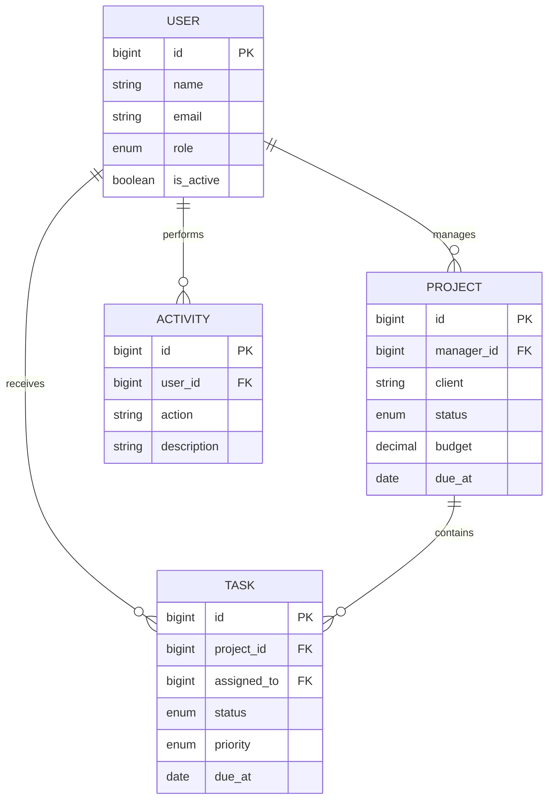

# Laravel Admin Suite

[](https://laravel.com)
[](https://www.php.net)
[](https://github.com/alopezr777/laravel-admin-suite/actions/workflows/tests.yml)
[](LICENSE)

A portfolio-ready administration workspace built with Laravel. It demonstrates a realistic internal application with authentication, role-based access, project and task management, reporting metrics, activity tracking, responsive UI and automated tests.

## Why this project exists

This repository is a complete technical showcase rather than a static UI concept. The application covers the workflows commonly requested for internal business platforms: data modelling, secure access, CRUD operations, filters, validation, audit history and maintainable presentation code.

## Main features

- Secure session authentication with active-account checks
- Dashboard metrics for projects, open work, overdue items and team capacity
- Project portfolio with client, manager, budget, dates, priority and progress
- Task management with assignments, workflow status and due-date tracking
- Three access roles: administrator, manager and member
- Administrator-only team management and activity log
- Search and status filters with pagination
- Sample data and ready-to-use demo credentials
- Responsive interface for desktop, tablet and mobile
- Feature tests and a GitHub Actions CI workflow

## Technology

| Layer | Tools |
|---|---|
| Backend | PHP 8.3, Laravel 13, Eloquent ORM |
| Frontend | Blade, custom CSS, JavaScript, Vite |
| Database | SQLite by default; MySQL configuration included |
| Quality | PHPUnit, Laravel Pint, GitHub Actions |

## Data model



## Local installation

Requirements: PHP 8.3+, Composer, Node.js 20+ and the SQLite PHP extension.

```bash
git clone https://github.com/alopezr777/laravel-admin-suite.git
cd laravel-admin-suite
composer install
cp .env.example .env
touch database/database.sqlite
php artisan key:generate
php artisan migrate --seed
npm install
npm run build
php artisan serve
```

Open `http://127.0.0.1:8000`.

### Demo credentials

```text
Email: admin@example.com
Password: password
```

Additional seeded accounts use the same password: `manager@example.com`, `daniel@example.com` and `maya@example.com`.

## Useful commands

```bash
# Start the web server, queue worker and Vite together
composer run dev

# Run automated tests
composer test

# Check code style
./vendor/bin/pint --test

# Reset the demo database
php artisan migrate:fresh --seed
```

## Project structure

```text
app/
├── Http/Controllers/    # Authentication and CRUD workflows
├── Http/Middleware/     # Administrator access enforcement
└── Models/              # Users, projects, tasks and activities
database/
├── factories/
├── migrations/
└── seeders/
resources/
├── css/                 # Responsive design system
├── js/                  # Navigation and confirmation behaviour
└── views/                # Blade screens and reusable forms
tests/Feature/            # Authentication, authorization and CRUD coverage
```

## Security notes

- Passwords are hashed through Laravel's built-in cast.
- Forms use CSRF protection and server-side validation.
- Sessions regenerate after authentication.
- Disabled accounts cannot sign in.
- Administrative routes are protected by a dedicated middleware alias.
- The signed-in administrator cannot disable or delete their own account.

## License

Released under the [MIT License](LICENSE).
